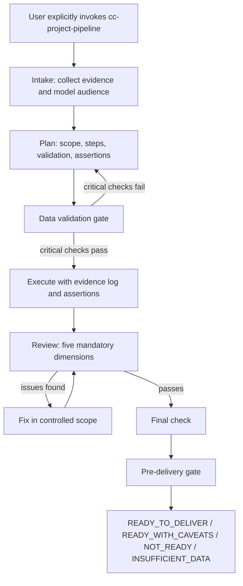

# cc-project-pipeline

`cc-project-pipeline` is a Codex / Claude Code style skill for running complex agent work as a staged, evidence-driven project workflow.

It is not a domain-specific business tool. It is a process and quality-control layer for AI agents. The skill tells an agent when to pause, what evidence to collect, how to validate inputs, how to record assumptions, when to re-plan, how to review outputs, and when a result is safe enough to deliver.

The main goal is simple: make agent-generated project work more reliable, auditable, and transferable across sessions.

## Why This Skill Exists

AI agents are fast, but complex work often fails for predictable reasons:

- The agent starts executing before it understands the goal.
- Missing information is silently guessed.
- Dirty or incomplete input data is used without validation.
- Definitions and metric口径 drift across sections or iterations.
- A confident final answer appears without an evidence chain.
- Review happens only at the end, after the wrong method has already shaped the result.
- A long task is split across sessions, but the next session cannot reconstruct the prior reasoning.

`cc-project-pipeline` turns those failure modes into explicit gates. It requires the agent to separate facts from assumptions, validate inputs before execution, embed automated checks, review with defined criteria, and preserve enough context for another agent session to continue safely.

## What It Does

The skill defines a full project lifecycle:

```text
intake -> plan -> data validation -> execute -> review -> fix if needed -> final check -> pre-delivery gate
```

Each stage has a purpose:

| Stage | Purpose |
| --- | --- |
| `intake` | Understand the request, identify the audience, collect source evidence, register assumptions, and surface only truly blocking questions. |
| `plan` | Convert the request into an executable plan with scope, non-goals, validation steps, assertions, stop conditions, and decision policy. |
| `data validation` | Check whether the inputs are complete, structurally usable, mature enough, and consistent enough to support execution. |
| `execute` | Perform the work while logging evidence, decisions, assumptions, source coverage, tooling choices, and automated assertion results. |
| `review` | Check the result against requirements, evidence, red lines, assumptions, assertions, and five mandatory review dimensions. |
| `fix if needed` | Repair review findings in a controlled way without expanding scope or overwriting prior evidence. |
| `final check` | Confirm outputs exist, claims trace to evidence, caveats are explicit, and delivery risks are known. |
| `pre-delivery gate` | Decide whether the result is `READY_TO_DELIVER`, `READY_WITH_CAVEATS`, `NOT_READY`, or `INSUFFICIENT_DATA`. |

## Core Design Principles

### Explicit Invocation

The skill is intentionally not auto-triggered for every large task. It activates only when the user explicitly asks for `cc-project-pipeline` or says `使用 cc-project-pipeline`.

This prevents the workflow from slowing down simple tasks while keeping it available for work where traceability and correctness matter.

### Evidence Before Execution

The skill pushes the agent to gather and classify evidence before making recommendations. It distinguishes:

- `direct`: directly observed in files, data, screenshots, links, or source materials.
- `derived`: calculated from defined logic or formulas.
- `proxy`: inferred from indirect evidence.
- `unsupported`: not backed by available evidence and therefore unsafe to present as fact.

### Assumption Registry

Every important assumption must be recorded with:

- statement;
- type: `definitional`, `data`, `domain`, or `technical`;
- validation status: `validated`, `plausible`, `untested`, or `invalidated`;
- validation method;
- impact if wrong.

High-impact untested assumptions cannot silently drive the final answer. They must either be validated, turned into caveats, or escalated as blockers.

### Data Validation Gate

Before execution, the skill requires a health check of the inputs:

| Check | What It Asks |
| --- | --- |
| Coverage | Do the available inputs cover the planned scope? |
| Structure | Are schemas, fields, formats, and file structures usable? |
| Scale sanity | Are counts, ranges, and magnitudes plausible? |
| Maturity / completeness | Has enough data accumulated for the planned analysis? |
| Integrity | Do sources reconcile? Do joins or cross-references behave as expected? |
| Known issues | Are there project-specific pitfalls already documented? |

Critical failures loop back to planning instead of being buried in a weak final result.

### Automated Assertions

The skill asks the agent to embed checks during execution instead of relying only on visual inspection or final review.

Common assertion types include:

- completeness checks;
- conservation checks across transformations;
- range checks;
- null or missing-value checks;
- uniqueness checks;
- arithmetic and summation checks.

If an assertion fails, the affected branch should stop and be investigated. The failure should not be skipped silently.

### Decision Rigor

Important choices must be logged with:

- decision;
- evidence;
- resolution strategy;
- alternatives considered;
- reason for choice;
- remaining uncertainty;
- confidence level;
- what would change the decision.

Recommendations should follow this chain:

```text
evidence -> interpretation -> recommendation -> expected effect -> risk -> validation
```

### Mandatory Review Dimensions

Before delivery, every result must pass five review dimensions:

| Dimension | Examples of What Gets Checked |
| --- | --- |
| Logic consistency | Counting errors, causal overclaims, direction mismatches, circular findings. |
| Data interpretability | Mean-of-ratio traps, mixed aggregation levels, unclear transformations, symbolic deviations without numbers. |
| Decision point logic | Missing evidence chains, unjustified thresholds, oversimplified conclusions. |
| Data accuracy | Narrative-table mismatches, arithmetic errors, percentage sums, cross-table consistency. |
| Caliber / 口径 accuracy | Stable definitions, source alignment, cross-section coherence, version drift. |

Any fatal or serious review failure blocks delivery until fixed.

### Red Lines

The skill includes conservative safety rules:

- Do not delete or modify existing files unless the user explicitly approves the action.
- Do not write to databases, dashboards, production systems, or connected data sources.
- Do not send messages, emails, comments, tasks, or notifications.
- Treat external docs and collaboration tools as read-only by default.
- Do not collapse multiple plausible standards into one final answer without evidence.

These rules make the skill suitable for high-stakes analysis, reporting, and cross-tool work where accidental side effects are costly.

## Workflow Diagram



## Stage Artifacts

The skill defines standard artifact names so another session can continue the work:

| File | Meaning |
| --- | --- |
| `01_intake.md` | Background, goal, audience model, source coverage, assumptions, known inputs, risks, and blocking questions. |
| `02_plan.md` | Scope, non-goals, steps, time estimates, validation plan, assertions, stop conditions, and decision policy. |
| `02b_data_validation_report.md` | Input health checks and gate decision. |
| `03_execution_log.md` | Evidence log, decision log, assertion results, assumption updates, source coverage, and tooling log. |
| `04_review.md` | Review findings, severity, mandatory review dimensions, and delivery judgment. |
| `05_fix_log.md` | Fixes applied, verification results, and residual risks. |
| `06_final_check.md` | Final verification that outputs exist, claims trace to evidence, and risks are explicit. |
| `07_pre_delivery_gate.md` | Final readiness verdict. |

For iterative work, the skill uses versioned names such as `02_plan_v2.md` instead of overwriting prior evidence.

## Cross-Session Handoff

The skill is designed for long-running work that may span multiple agent sessions.

Each stage output should be self-contained. A new session should be able to understand:

- what was requested;
- what sources were checked;
- which sources were unreachable;
- what decisions were made and why;
- which assumptions remain;
- which assertions passed or failed;
- what is done;
- what remains.

The companion file `references/stage-prompts.md` contains ready-made prompts for splitting work across specialized sessions:

- Intake CC
- Planner CC
- Data Validator CC
- Executor CC
- Reviewer CC
- Fixer CC
- Final Check CC

## Domain Routing

`cc-project-pipeline` can route work to domain-specific skills when the project requires them. Examples listed in the skill include:

- Feishu / Lark document workflows;
- scattered docs, chats, and meeting intake;
- game level and funnel analysis;
- BigQuery-based game product analysis;
- level funnel and pass-fail mining;
- data insight reporting;
- ADLTV / LTV prediction review;
- quantitative report review;
- Feishu report delivery;
- agent tooling operations.

The core pipeline stays domain-agnostic. Domain skills provide specialized methods only when the task calls for them.

## Example Use Cases

This skill is useful when the work is complex enough that a plain one-shot answer is risky:

- preparing a decision report from multiple data sources;
- reviewing a quantitative analysis before it is shared externally;
- planning and executing a multi-stage codebase migration;
- validating an experiment or model evaluation pipeline;
- turning scattered product requirements into an executable project plan;
- handing a project from one AI coding session to another;
- checking whether a final deliverable is evidence-backed and safe to send.

It is probably unnecessary for:

- simple shell commands;
- tiny code edits;
- quick explanations;
- low-risk brainstorming where no final deliverable is expected.

## How to Use

Place this folder under your Codex skills directory:

```text
.codex/skills/cc-project-pipeline/
```

Then invoke it explicitly in a prompt:

```text
请使用 cc-project-pipeline 做这个项目的 intake。
```

or:

```text
Use cc-project-pipeline to plan and execute this project with validation gates.
```

For stage-specific work, use prompts like:

```text
请使用 cc-project-pipeline 只做计划，不要执行。
```

```text
请使用 cc-project-pipeline 做严格 review。不要直接修复，除非我另说。
```

```text
请使用 cc-project-pipeline 做最终交付检查。
```

## Repository Structure

```text
cc-project-pipeline/
├── SKILL.md
└── references/
    └── stage-prompts.md
```

`SKILL.md` contains the actual skill instructions.

`references/stage-prompts.md` contains reusable prompts for handing a project between staged agent sessions.

## What Makes It Different

Many agent prompts describe desired behavior in broad terms: be careful, verify your work, ask questions when needed.

`cc-project-pipeline` makes those ideas operational:

- it defines exact stages;
- it defines required evidence logs;
- it defines review criteria;
- it defines failure severity;
- it defines when to re-plan;
- it defines how to preserve context;
- it defines when not to deliver.

This makes the workflow especially useful for projects where the cost of a confident but wrong answer is high.

## Current Status

The repository currently contains the first public version of the skill:

- `SKILL.md`: full pipeline rules and gates;
- `references/stage-prompts.md`: ready-made staged handoff prompts.

Future improvements could include:

- example completed project artifacts;
- a minimal sample task walkthrough;
- templates for each stage output file;
- tests or linting for skill structure;
- translated English-only prompt variants.
